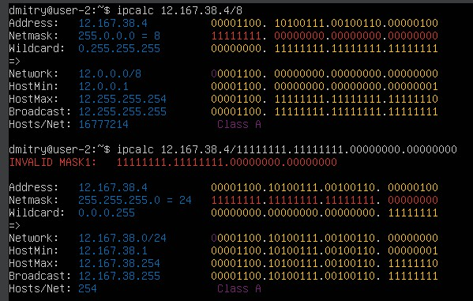

# Page 1

### Part 1. Инструмент **ipcalc**

#### 1.1. Сети и маски

1. Адрес сети 192.167.38.54/13:&#x20;

<figure><figcaption></figcaption></figure>

2. Перевод маски 255.255.255.0 в префиксную и двоичную запись, /15 в обычную и двоичную, 11111111.11111111.11111111.11110000 в обычную и префиксную:

<figure><figcaption></figcaption></figure>

3. Минимальный и максимальный хост в сети 12.167.38.4 при масках: /8, 11111111.11111111.00000000.00000000, 255.255.254.0 и /4:

<figure><figcaption></figcaption></figure>

<figure><figcaption></figcaption></figure>

#### 1.2. localhost

<figure><figcaption></figcaption></figure>

<figure><figcaption></figcaption></figure>

Локальный IP-адрес 127.0.0.1 всегда обозначает устройство, на котором он используется, поэтому любое приложение, работающее на localhost, сможет обратиться к себе через этот адрес. Другие IP-адреса из списка (194.34.23.100, 127.0.0.2, 127.1.0.1, 128.0.0.1) не будут считаться локальными и не будут связаны с localhost.

#### 1.3. Диапазоны и сегменты сетей

1. &#x20;Какие из перечисленных IP можно использовать в качестве публичного, а какие только в качестве частных:

* Публичные IP-адреса: 134.43.0.2, 172.0.2.1, 192.172.0.1, _172.68.0.2, 192.169.168.1_

<figure><figcaption></figcaption></figure>

* Частные IP-адреса: 10.0.0.45, 192.168.4.2, 172.20.250.4, 172.16.255.255, 10.10.10.10

<figure><figcaption></figcaption></figure>

2. &#x20;Какие из перечисленных IP адресов шлюза возможны у сети 10.10.0.0/18:

Диапазон IP-адресов в сети 10.10.0.0/18: 10.10.0.1 - 10.10.63.254

* Возможны : 10.10.0.1, 10.10.10.10, 10.10.0.2, 10.10.1.255&#x20;
* Не возможны: 10.10.100.1

<figure><figcaption></figcaption></figure>

### Part 2. Статическая маршрутизация между двумя машинами

#### Настройка машин

1. С помощью команды `ip a` посмотреть существующие сетевые интерфейсы

<figure><figcaption>
ip a для обеих машин
</figcaption></figure>

2. Описать сетевой интерфейс, соответствующий внутренней сети, на обеих машинах и задать следующие адреса и маски: ws1 - _192.168.100.10_, маска _/16_, ws2 - _172.24.116.8_, маска _/12_

<figure><figcaption>
<em>etc/netplan/00-installer-config.yaml</em>
</figcaption></figure>

3. Выполнить команду `netplan apply` для перезапуска сервиса сети

<figure><figcaption>
Применение статических настроек сети для обеих машин
</figcaption></figure>

#### Добавление статического маршрута вручную

1. Добавить статический маршрут от одной машины до другой и обратно при помощи команды вида `ip r add`

<figure><figcaption>
ip route add для каждой из машин
</figcaption></figure>

2. Пропинговать соединение между машинами

<figure><figcaption>
Пинг машин друг друга
</figcaption></figure>

#### Добавление статического маршрута с сохранением

1. Добавить статический маршрут от одной машины до другой с помощью файла _etc/netplan/00-installer-config.yaml_

<figure><figcaption>
<em>etc/netplan/00-installer-config.yaml</em>
</figcaption></figure>

2. Пропинговать соединение между машинами

<figure><figcaption>
Пинг машин друг друга
</figcaption></figure>

### Part 3. Утилита **iperf3**

#### **Скорость соединения**

1. Перевести и записать в отчёт: 8 Mbps в MB/s, 100 MB/s в Kbps, 1 Gbps в Mbps

*   8 Mbps (мегабит в секунду) в MB/s (мегабайты в секунду):

    1 Мбит = 0.125 МБ 8 Мбит = 1 МБ Таким образом, 8 Mbps = 1 MB/s.
*   100 MB/s (мегабайт в секунду) в Kbps (килобиты в секунду):

    1 МБ = 8 Мбит 100 МБ = 800 Мбит Таким образом, 100 MB/s = 800 Kbps.
*   1 Gbps (гигабит в секунду) в Mbps (мегабиты в секунду):

    1 Гбит = 1000 Мбит Таким образом, 1 Gbps = 1000 Mbps.

2. Утилита **iperf3**

<figure><figcaption></figcaption></figure>

* `Interval`: Временной интервал, в течение которого происходило измерение.
* `Transfer`: Общий объем переданных данных за интервал времени.
* `Bandwidth`: Пропускная способность, измеренная в гигабитах в секунду (Gbits/sec).

Таким образом, скорость передачи 4.64 Gbits/sec

### Part 4. Сетевой экран

#### Утилита **iptables**

1. Создать файл _/etc/firewall.sh_, имитирующий фаерволл, на ws1 и ws2:

<figure><figcaption></figcaption></figure>

2. В отчёт поместить скрины с содержанием файла _/etc/firewall_ для каждой машины.

<figure><figcaption>
firewall.sh в /etc/
</figcaption></figure>

3. Запустить файлы на обеих машинах командами `chmod +x /etc/firewall.sh` и `/etc/firewall.sh`

<figure><figcaption>
Звпуст firewall.sh
</figcaption></figure>

4. Разница между стратегиями

* На ws1, первым добавляется правило, блокирующее исходящие пакеты ICMP Echo Request (Ping), а затем разрешаются входящие пакеты ICMP Echo Reply. Это означает, что на ws1 машина не может быть "пропингована", но она может пинговать другие машины.
* На ws2, первым добавляется правило разрешения входящих пакетов ICMP Echo Reply, а затем добавляется правило блокировки исходящих пакетов ICMP Echo Request. Таким образом, на ws2 машину можно "пропинговать", но она не может пинговать другие машины.

#### Утилита **nmap**

<figure><figcaption>
Машина ws1 запущена, но пинговать ее не удается.
</figcaption></figure>

### Part 5. Статическая маршрутизация сети

#### Настройка адресов машин

1. Настроить конфигурации машин в _etc/netplan/00-installer-config.yaml_ согласно сети на рисунке.

<figure><figcaption></figcaption></figure>

<figure><figcaption></figcaption></figure>

2. Перезапустить сервис сети. Если ошибок нет, то командой `ip -4 a` проверить, что адрес машины задан верно. Также пропинговать ws22 с ws21. Аналогично пропинговать r1 с ws11.

<figure><figcaption>
ip -4 a ws_all
</figcaption></figure>

<figure><figcaption>
ip4ar12
</figcaption></figure>

<figure><figcaption></figcaption></figure>

#### Включение переадресации IP-адресов.

1. Для включения переадресации IP, выполните команду на роутерах:

<figure><figcaption>
r1 sysctl -w net.ipv4.ip_forward=1 
</figcaption></figure>

<figure><figcaption>
r2 sysctl -w net.ipv4.ip_forward=1
</figcaption></figure>

2. Откройте файл _/etc/sysctl.conf_ и добавьте в него следующую строку:

<figure><figcaption>
 <em>/etc/sysctl.conf on</em> r1
</figcaption></figure>

<figure><figcaption>
<em>/etc/sysctl.conf on r2</em>
</figcaption></figure>

#### Установка маршрута по-умолчанию

1. Настроить маршрут по-умолчанию (шлюз) для рабочих станций. Для этого добавить `default` перед IP роутера в файле конфигураций
2. Вызвать `ip r` и показать, что добавился маршрут в таблицу маршрутизации

<figure><figcaption></figcaption></figure>

3. Пропинговать с ws11 роутер r2 и показать на r2, что пинг доходит.

<figure><figcaption></figcaption></figure>

#### Добавление статических маршрутов

1. Добавить в роутеры r1 и r2 статические маршруты в файле конфигураций.

<figure><figcaption></figcaption></figure>

2. Запустить команды на ws11:

`ip r list 10.10.0.0/[маска сети]` и `ip r list 0.0.0.0/0`

* В отчёт поместить скрин с вызовом и выводом использованных команд.
* В отчёте объяснить, почему для адреса 10.10.0.0/\[маска сети] был выбран маршрут, отличный от 0.0.0.0/0, хотя он попадает под маршрут по-умолчанию.

Результат выполнения команды ip r list на машине ws11 для адресов 10.10.0.0/18 и 0.0.0.0/0 приведены ниже. Для маршрута 10.10.0.0/18 был выбран маршрут, отличный от default потому что машина ws11 итак подключена к этой сети с помощью интерфейса enp0s8, для адреса 10.10.0.0/18 будет использован маршрут по умолчанию.

<figure><figcaption></figcaption></figure>

#### **Построение списка маршрутизаторов**

1. При помощи утилиты traceroute построить список маршрутизаторов на пути от ws11 до ws21

* В отчёт поместить скрины с вызовом и выводом использованных команд (tcpdump и traceroute).

<figure><figcaption></figcaption></figure>

<figure><figcaption></figcaption></figure>

<figure><figcaption></figcaption></figure>

* В отчёте, опираясь на вывод, полученный из дампа на r1, объяснить принцип работы построения пути при помощи

Принцип работы `traceroute` заключается в посылке пакетов с увеличающимся TTL. Пакет с TTL=1 дойдет только до первого маршрутизатора (первого хопа), который уменьшит TTL до 0 и вернет ответ об ошибке. Пакет с TTL=2 дойдет до второго маршрутизатора и так далее. Это позволяет `traceroute` построить список всех маршрутизаторов, через которые проходят пакеты, от источника к цели.

#### Использование протокола **ICMP** при маршрутизации

1. Запустить на r1 перехват сетевого трафика, проходящего через eth0 с помощью команды:

`tcpdump -n -i eth0 icmp`

2. Пропинговать с ws11 несуществующий IP (например, _10.30.0.111_) с помощью команды:

`ping -c 1 10.30.0.111`

* В отчёт поместить скрин с вызовом и выводом использованных команд.

<figure><figcaption></figcaption></figure>

<figure><figcaption></figcaption></figure>

### Part 6. Динамическая настройка IP с помощью **DHCP**

1. Для r2 настроить в файле _/etc/dhcp/dhcpd.conf_ конфигурацию службы DHCP:

* указать адрес маршрутизатора по-умолчанию, DNS-сервер и адрес внутренней сети.
* в файле _resolv.conf_ прописать `nameserver 8.8.8.8.`

<figure><figcaption></figcaption></figure>

2. Перезагрузить службу **DHCP** командой `systemctl restart isc-dhcp-server`. Машину ws21 перезагрузить при помощи `reboot` и через `ip a` показать, что она получила адрес. Также пропинговать ws22 с ws21.

<figure><figcaption></figcaption></figure>

<figure><figcaption></figcaption></figure>

<figure><figcaption></figcaption></figure>

2. Указать MAC адрес у ws11, для этого в _etc/netplan/00-installer-config.yaml_ надо добавить строки: `macaddress: 10:10:10:10:10:BA`, `dhcp4: true`

<figure><figcaption></figcaption></figure>

2. Для r1 настроить аналогично r2, но сделать выдачу адресов с жесткой привязкой к MAC-адресу (ws11).

<figure><figcaption></figcaption></figure>

<figure><figcaption></figcaption></figure>

2. Запросить с ws21 обновление ip адреса

<figure><figcaption></figcaption></figure>

<figure><figcaption></figcaption></figure>

Относительно настроек DHCP-сервера, в данном пункте был использован стандартный  DHCP запрос нового IP-адреса с помощью `dhclient`. DHCP-сервер предоставил новый IP-адрес на основе своей конфигурации, которая была настроена на `r2` в предыдущих шагах.

### Part 7. **NAT**

1. В файле _/etc/apache2/ports.conf_ на ws22 и r1 изменить строку `Listen 80` на `Listen 0.0.0.0:80`, то есть сделать сервер Apache2 общедоступным

<figure><figcaption></figcaption></figure>

2. Запустить веб-сервер Apache командой `service apache2 start` на ws22 и r1

<figure><figcaption></figcaption></figure>

3.  Добавить в фаервол, созданный по аналогии с фаерволом из Части 4, на r2 следующие правила:\
    1\) удаление правил в таблице filter - `iptables -F`

    2\) удаление правил в таблице "NAT" - `iptables -F -t nat`

    3\) отбрасывать все маршрутизируемые пакеты - `iptables --policy FORWARD DROP`

<figure><figcaption></figcaption></figure>

4. Проверить соединение между ws22 и r1 командой `ping`

<figure><figcaption></figcaption></figure>

5. разрешить маршрутизацию всех пакетов протокола **ICMP**

<figure><figcaption></figcaption></figure>

6. Проверить соединение между ws22 и r1 командой `ping`

<figure><figcaption></figcaption></figure>

7.  Добавить в файл ещё два правила:

    5\) включить SNAT, а именно маскирование всех локальных ip из локальной сети, находящейся за r2 (по обозначениям из Части 5 - сеть 10.20.0.0)

    6\) включить DNAT на 8080 порт машины r2 и добавить к веб-серверу Apache, запущенному на ws22, доступ извне сети

<figure><figcaption></figcaption></figure>

Проверить соединение по TCP для SNAT, для этого с ws22 подключиться к серверу Apache на r1 командой:

<figure><figcaption></figcaption></figure>
